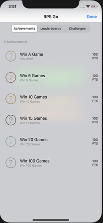
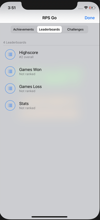
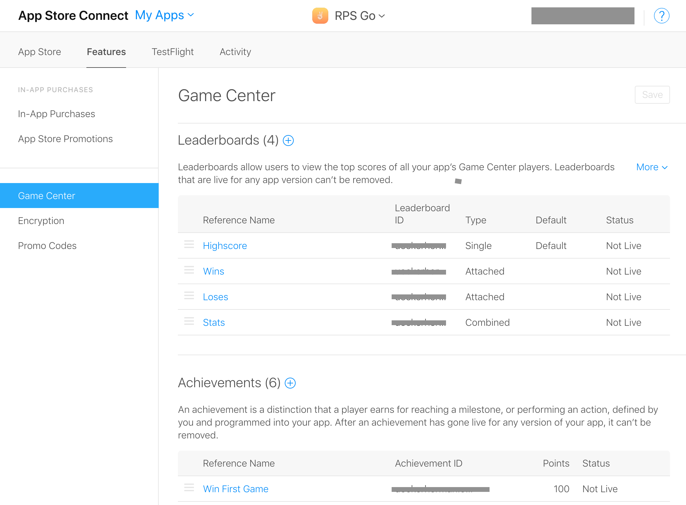
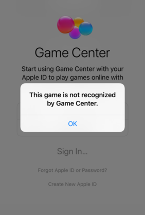

Overview
=======
The following tutorial will be using Apple's `GameKit` framework using Swift 5. With GameKit we can create applications that allow us to interact with other iOS users through Game Center's network. Some of the many examples you can implement to your own application are: achievements, leaderboards, and challenges. Through Game Center you are also able to add real time multiplayer or turn based multiplayer. The following screenshots below gives a small glance of what you will be able to create with GameKit. Our game is Rock, Paper, Scissors and is adapted from Rminsh's RPS ([Link to repository](https://github.com/Rminsh/RPS))

   


Getting started
=======

Set up Game Center in XCode project
----
Go to **PROJECT>TARGETS>Signing & Capabilites**<br />
Click the plus sign next to capabilities to add a new capability. In the prompt that pops up search for `Game Center`. When complete it should show up like below.


Register your game with App Store Connect
----
To use Game Center's features you have to authenticate the player with Game Center. Before you can do that your game must be registered with Apple. To register head over to [App Store Connect](https://appstoreconnect.apple.com) website (This does require an Apple Developer Account). 


Once your app is registered, select it and go to **Features>Game Center**



From here you can manage all of your achievements and leaderboards. When you make a new leaderboard or achievement keep in mind that the identifier you choose cannot be changed later. You will use this identifier in your code to save players progress and data to the leaderboard or achievement that corresponds to the identifier.

You are now ready to start implementing `Game Center` in your code.

Implementing Game Center
=======

Authenticating player
---
The first that you want to think about is authenticating the player, and then sooner you do this the better. The best time is after the loading screen or when the initial `ViewController` gets loaded. 
```swift
 GKLocalPlayer.local.authenticateHandler = { gcAuthVC, error in
      if GKLocalPlayer.local.isAuthenticated {
        GKLocalPlayer.local.register(self)
      } else if let vc = gcAuthVC {
        self.viewController?.present(vc, animated: true)
      }
      else {
        print("Error authentication to GameCenter: \(error?.localizedDescription ?? "none")")
      }
    }
  }
```
The code above will present the Game Center login `ViewController` if the local player has not signed in. If the player has been signed before, the next time they open the game a notification badge will show at the top of the screen welcoming the player back.

You have to add a GameKit delegate to dimiss the Game Center ViewController
```swift
extension MenuViewController: GKGameCenterControllerDelegate {
    func gameCenterViewControllerDidFinish(_ gameCenterViewController: GKGameCenterViewController) {
        gameCenterViewController.dismiss(animated: true, completion: nil)
    }
}
```

Game Center identifiers
---
In our code we saved leaderboard and achievement identifiers in a class called **ID**. Each identifier is a constant so that it can be easily used within the entire project. 

```swift
class ID {
    
    // Leaderboards
    static let HIGHSCORE = "ueckerherman.ockerse.rps.leaderboard"
   
    //Achievements
    static let WIN_1 = "username.rps.WinOneGame"
    static let WIN_5 = "username.rps.WinFive"
    static let WIN_10 = "username.rps.WinTen"
    static let WIN_15 = "username.rps.WinFifteen"
    static let WIN_20 = "username.rps.WinTwenty"
    static let WIN_100 = "usernamerps.WinHundred"
}
```


Viewing achievements in Game Center
---
```swift
func showAchievements() {
        let gcVC = GKGameCenterViewController()
        gcVC.gameCenterDelegate = self
        gcVC.viewState = .achievements
        present(gcVC, animated: true, completion: nil)
    }
```
This code instantiates the Game Center `ViewController` and assigns it to the delegate. The `viewState` is set to `.achievements` to load the achievements view. Lastly, the `ViewController` is presented to the screen.

Viewing leaderboard in Game Center
---
```swift
func showLeaderboards() {
        let gcVC = GKGameCenterViewController()
        gcVC.gameCenterDelegate = self
        gcVC.viewState = .leaderboards
        //gcVC.leaderboardIdentifier = ID.HIGHSCORE
        present(gcVC, animated: true, completion: nil)
    }
```
Similar to the achivements, we can do the same for leaderboards. The only difference is that the `viewState` is set to `.leaderboards` to show leaderboards. Optionally, you can view a specific leaderboard by specifying the `.leaderboardIdentifier` to the identifier of the leaderboard you want.

Submit scores to Game Center
---
```swift
  func reportScore(score: Int64, ID: String) {
        let reportedScore = GKScore(leaderboardIdentifier: ID)
        reportedScore.value = score
        GKScore.report([reportedScore]) { (error) in
          guard error == nil else {
          print(error?.localizedDescription ?? "")
          return
          }
        }
      }
```
To submit a score to Game Center you need to create a `GameKit` GKScore object with the leaderboard indentifier you are updating. We called this `reportedScore`.Then you set the `reportedScore.value` to the value of the score, keep in mind the score must be an `Int64`. 

Update achievement progress
---
```swift
   func reportAchievement(pc: Double, ID: String ) {
        let achievement = GKAchievement(identifier: ID)
        achievement.percentComplete = pc
        achievement.showsCompletionBanner = true
        GKAchievement.report([achievement]) { (error) in
          print(error?.localizedDescription ?? "")
        }
      }
```
To update an achievements progress you create a `GameKit` GKAchievement object with the achievement identifier you are updating. We called it achievements. Then you can set the `achievements.percentComplete` to new progress percentage, keep in mind that the progress is a double. If an achievement is not incrementally earned, then you can set the `achievements.progressComplete` to `100.00` when the achivement requirements are met.

Getting current values from Game Center
---
You can load data from Game Center to use within your game. Below we load the current achievement progress for the player each time the game is loaded and re-loaded when a match is complete.
```swift
func loadAchievementProgress() {
    GKAchievement.loadAchievements() { achievements, error in
        guard let achievements = achievements else { return }
          for ach in achievements {
              for (key, _) in Progress {
                  if(ach.identifier == key){
                      Progress.updateValue(ach.percentComplete, forKey: ach.identifier)
                  }
              }
          }
         }
    }
```
The `GKAchievement.loadAchievements()` is an asynchronous call that returns the achievement data. When loaded, we save the data locally in a dictionary called `Progress`.

Common Mistakes
===

Game not recognized by Game Center
---


Storing and returning scores
---

Conclusion
=======
