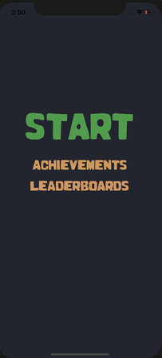

Overview
=======
The following tutorial will be using Apple's Gamekit framework using Swift 5. With Gamekit we can create applications that allow us to interact with other iOS users through Game Centers own network. Some of the many examples you can implement to your own application are: achievements, leaderboards, and challenges. Through Game Center you are also able to add real time multiplayer or turn base multiplayer. The following screenshots below gives a small glance of what you will be able to create with Gamekit. 

   


Getting started
=======

Set up Game Center in XCode project
----
Go to <b>PROJECT>TARGETS>Signing & Capabilites</b><br />
Click the plus sign next to capabilities to add a new capability. In the prompt that pops up search for Game Center. When complete it should show up like below.


Register your game with App Store Connect
----
To use Game Center's features you have to authenticate the player with Game Center. Before you can do that your game must be registered with Apple. To register head over to [App Store Connect](https://appstoreconnect.apple.com) website (This does require an Apple Developer Account). 


Once your app is registered, select it and go to <b>Features>Game Center</b>


From here you can manage all of your achievements and leaderboards. When you make a new leaderboard or achievement keep in mind that the identifier you choose cannot be changed later. You will use this identifier in your code to save players progress and data to the leaderboard or achievement that corresponds to the identifier.

You are now ready to start implementing Game Center in your code.

Step-by-step coding instructions
=======

Picking a game
----
There are many routes you can take with this depending on what game interests you the most, however, for this demonstration we will be using a Rock, Paper, Scissors game by Rminsh free to use [Link to repository](https://github.com/Rminsh/RPS)


Creating classes
----

The first class we will be creating will be creating variables based on the unique ID you created on the Apple Developer console. The code snibbet below is an example referencing the ones we created above this will be used later with the game logic.  

```swift
import Foundation
class ID {
    
    // Leaderboards
    static let HIGHSCORE = "ueckerherman.ockerse.rps.leaderboard"
    
    
    //Achievements
    static let WIN_1 = "username.rps.WinOneGame"
    static let WIN_5 = "username.rps.WinFive"
    static let WIN_10 = "username.rps.WinTen"
    static let WIN_15 = "username.rps.WinFifteen"
    static let WIN_20 = "username.rps.WinTwenty"
    static let WIN_100 = "username.rps.WinHundred"
    
}
```
```swift
import Foundation
import GameKit

class ScoreData {
    
    func ScoreData() {}
    
    func loadAchievementProgress() {
    GKAchievement.loadAchievements() { achievements, error in
           guard let achievements = achievements else { return }
          print(achievements)
          
          for ach in achievements {
            
              print("\(ach.identifier) : \(ach.percentComplete)")
              
              for (key, _) in Progress {
                  if(ach.identifier == key){
                      Progress.updateValue(ach.percentComplete, forKey: ach.identifier)
                  }
              }
          }
         }
    }
    
    
    func reportAchievement(pc: Double, ID: String ) {
        let achievement = GKAchievement(identifier: ID)
          
        achievement.percentComplete = pc
          print("percent complete: \(achievement.percentComplete) for: \(ID)")
    
        achievement.showsCompletionBanner = true
        GKAchievement.report([achievement]) { (error) in
          print(error?.localizedDescription ?? "")
        }
      }
    
    
    func getProgressVal(forKey: String) -> Double{
      // let res = Progress[forKey]
      //  return res!
        
        for (key, val) in Progress {
            if(key == forKey){
                return val
            }
        }
        
        return 0.0
    }
    
    
    
    func updateAchievementProgress() {
     
        
        
        let ONE_ONE : Double = 1/1 * 100
        let ONE_FIFTH: Double = 1/5 * 100
        let ONE_TEN: Double = 1/10 * 100
        let ONE_FIFTEEN: Double = 1/15 * 100
        let ONE_TWENTY: Double = 1/20 * 100
        let ONE_HUNDRED: Double = 1/100 * 100
        
       
        reportAchievement(pc: getProgressVal(forKey: ID.WIN_1)+ONE_ONE, ID: ID.WIN_1)
        reportAchievement(pc: getProgressVal(forKey: ID.WIN_5)+ONE_FIFTH, ID: ID.WIN_5)
        reportAchievement(pc: getProgressVal(forKey: ID.WIN_10)+ONE_TEN, ID: ID.WIN_10)
        reportAchievement(pc: getProgressVal(forKey: ID.WIN_15)+ONE_FIFTEEN, ID: ID.WIN_15)
        reportAchievement(pc: getProgressVal(forKey: ID.WIN_20)+ONE_TWENTY, ID: ID.WIN_20)
        //print("Progress val: \(getProgressVal(forKey: ID.WIN_100))")
        reportAchievement(pc: (getProgressVal(forKey: ID.WIN_100)+ONE_HUNDRED), ID: ID.WIN_100)
    
        
        loadAchievementProgress()
        
    }
    
    
    
}
```

```swift
import Foundation


var Progress: [String: Double] = [
    ID.WIN_1: 0.0,
    ID.WIN_5 : 0.0,
    ID.WIN_10 : 0.0,
    ID.WIN_15 : 0.0,
    ID.WIN_20 : 0.0,
    ID.WIN_100: 0.0
]
```

Conclusions
=======

```ruby
require 'redcarpet'
markdown = Redcarpet.new("Hello World!")
puts markdown.to_html
```

Paragraphs are separated
-----------
by a blank line.


Two spaces at the end of a line  
produces a line break.

Text attributes _italic_, 
**bold**, `monospace`.

Horizontal rule:


---
Strikethrough:
~~strikethrough~~

Bullet list:

  * apples
  * oranges
  * pears

Numbered list:

  1. lather
  2. rinse
  3. repeat

An [example](http://example.com).


test

> Markdown uses email-style > characters for blockquoting.

Inline <abbr title="Hypertext Markup Language">HTML</abbr> is supported.
